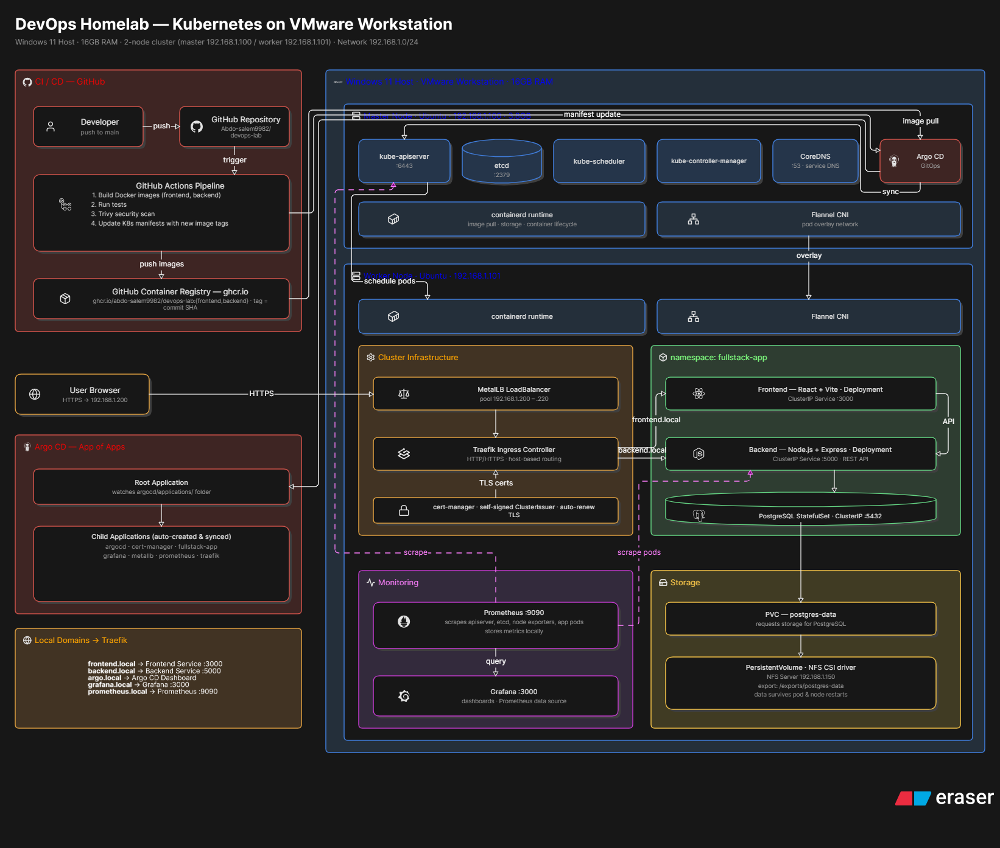
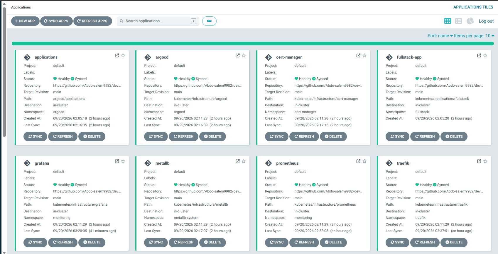
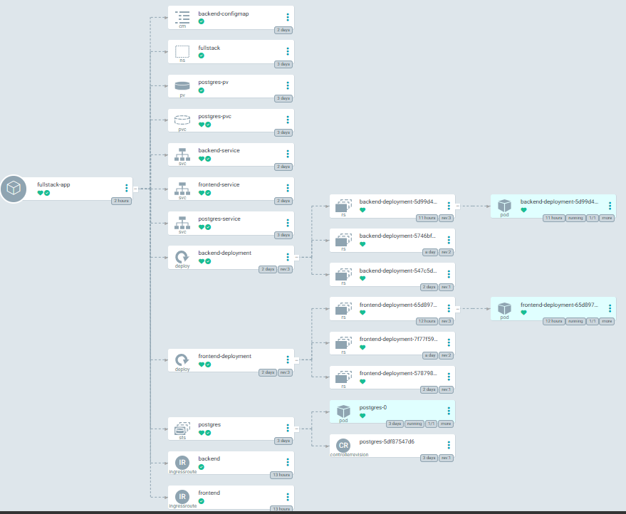
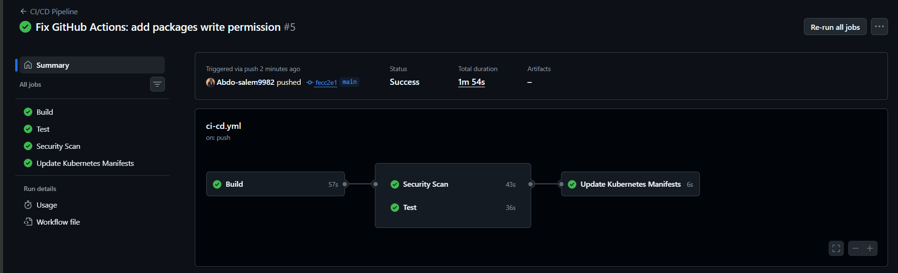
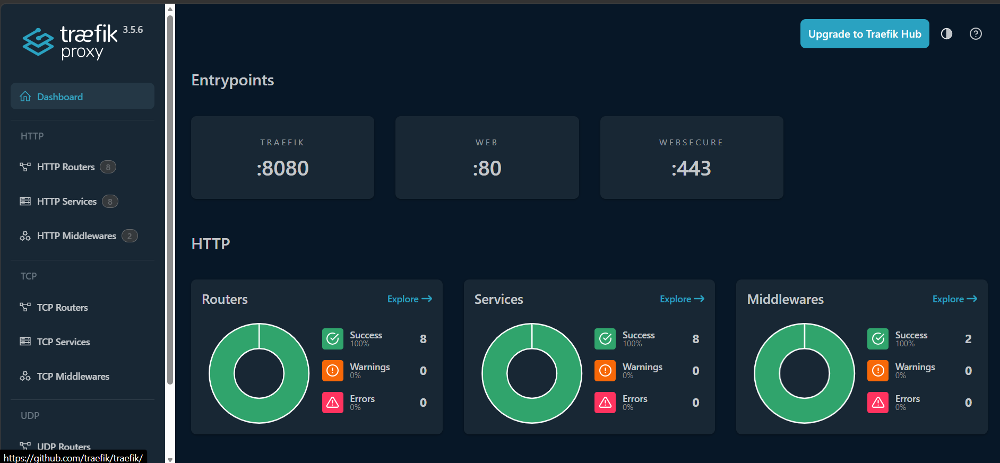
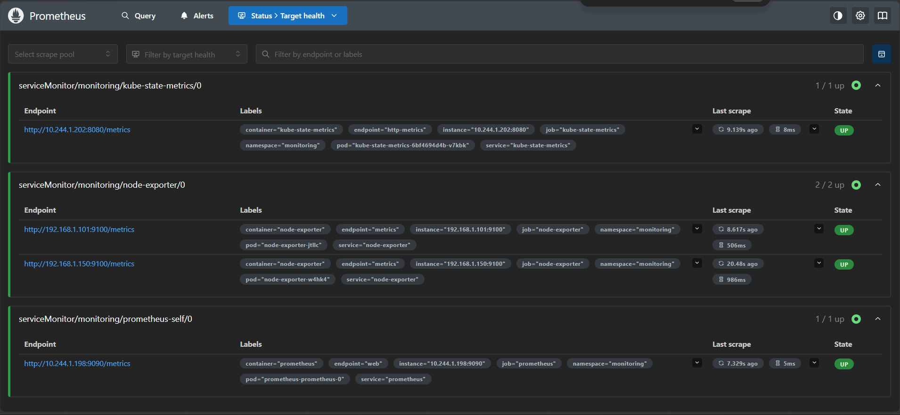
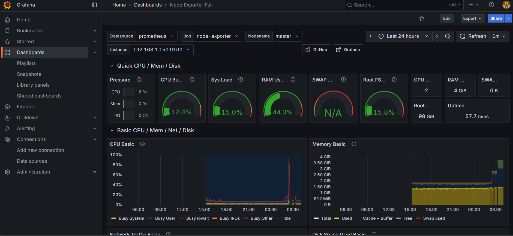
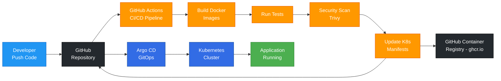

# DevOps Lab

Production-like DevOps/DevSecOps environment with Kubernetes, Argo CD, GitHub Actions, and a full-stack application.

## Project Architecture



## Components

| Component        | Purpose                     |
| ---------------- | --------------------------- |
| Kubernetes v1.30 | Container orchestration     |
| Flannel          | CNI network plugin          |
| MetalLB          | LoadBalancer for bare-metal |
| Traefik          | Ingress controller          |
| cert-manager     | TLS certificate management  |
| Argo CD          | GitOps continuous delivery  |
| Prometheus       | Monitoring                  |
| Grafana          | Dashboards                  |
| GitHub Actions   | CI/CD pipeline              |
| NFS              | Persistent storage          |

## Full-Stack Application

```
React + Vite + TailwindCSS (Frontend)
        |
        v
Node.js + Express (Backend)
        |
        v
PostgreSQL (Database)
```

## Screenshots

### Argo CD Dashboard



Argo CD manages all applications through GitOps. Each application is synced automatically from the GitHub repository.

### Argo CD Application Tree



Fullstack application tree showing all Kubernetes resources managed by Argo CD.

### GitHub Actions CI/CD



CI/CD pipeline with 4 stages: Build, Test, Security Scan, and Update Kubernetes Manifests.

### Traefik Dashboard



Traefik ingress controller managing HTTP routers, services, and middlewares.

### Prometheus Targets



Prometheus monitoring all targets including kube-state-metrics, node-exporter, and itself.

### Grafana Dashboard



Grafana Node Exporter dashboard showing CPU, memory, disk, and network metrics.

## Project Structure

```
devops-lab/
├── app/                    # Application source code
│   ├── backend/            # Node.js + Express
│   └── frontend/           # React + Vite
│
├── argocd/                 # Argo CD (App of Apps)
│   ├── applications.yaml   # Root application
│   └── applications/       # Child applications
│
├── kubernetes/
│   ├── applications/       # Full-stack app manifests
│   └── infrastructure/     # Platform components
│
├── .github/workflows/      # GitHub Actions CI/CD
├── docs/                   # Documentation
└── screenshots/            # Project screenshots
```

## Quick Start

See [docs/setup.md](docs/setup.md) for detailed installation instructions.

## Documentation

| Document                                   | Description                  |
| ------------------------------------------ | ---------------------------- |
| [Architecture](docs/architecture.md)       | System architecture overview |
| [Setup](docs/setup.md)                     | Installation guide           |
| [Networking](docs/networking.md)           | Network configuration        |
| [Storage](docs/storage.md)                 | Storage setup                |
| [Troubleshooting](docs/troubleshooting.md) | Common issues                |
| [Decisions](docs/decisions.md)             | Architecture decisions       |

## Accessing Services

| Service    | URL                      |
| ---------- | ------------------------ |
| Frontend   | https://frontend.local   |
| Backend    | https://backend.local    |
| Argo CD    | https://argo.local       |
| Grafana    | https://grafana.local    |
| Prometheus | https://prometheus.local |

## CI/CD Pipeline



## Getting Started

1. Clone the repository
2. Follow [docs/setup.md](docs/setup.md)
3. Deploy the full-stack application
4. Access services via browser

## Technologies Used

- **Container Runtime:** containerd
- **Orchestration:** Kubernetes
- **Networking:** Flannel, MetalLB, Traefik
- **Storage:** NFS
- **GitOps:** Argo CD
- **CI/CD:** GitHub Actions
- **Monitoring:** Prometheus, Grafana
- **Security:** cert-manager, Trivy

## License

This project is for learning purposes.
