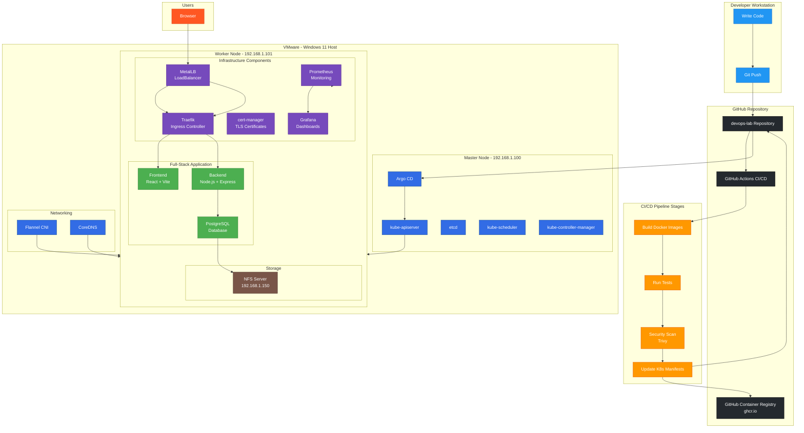
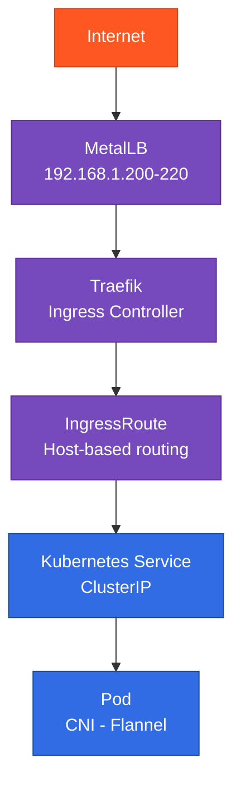
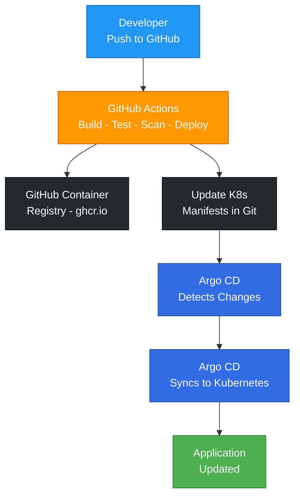

# Architecture Overview

## Project Architecture



## Lab Environment

```
Windows 11 Host (16GB RAM)
└── VMware
    ├── master (Control Plane) - 3.8GB RAM
    │   ├── kube-apiserver
    │   ├── etcd
    │   ├── kube-scheduler
    │   ├── kube-controller-manager
    │   └── Argo CD
    │
    └── worker (Worker Node)
        ├── Full-stack Application
        │   ├── Frontend (React + Vite)
        │   ├── Backend (Node.js + Express)
        │   └── PostgreSQL
        │
        ├── Infrastructure
        │   ├── Traefik (Ingress Controller)
        │   ├── MetalLB (LoadBalancer)
        │   ├── cert-manager (TLS)
        │   ├── Prometheus (Monitoring)
        │   └── Grafana (Dashboards)
        │
        └── Core Components
            ├── Flannel (CNI)
            ├── containerd (Runtime)
            └── CoreDNS (DNS)
```

## Technology Stack

| Layer | Technology | Purpose |
|-------|------------|---------|
| Container Runtime | containerd | Runs containers |
| CNI | Flannel | Pod networking |
| Ingress | Traefik | HTTP routing |
| LoadBalancer | MetalLB | External IPs |
| TLS | cert-manager | Certificate management |
| GitOps | Argo CD | Continuous delivery |
| Monitoring | Prometheus | Metrics collection |
| Visualization | Grafana | Dashboards |
| CI/CD | GitHub Actions | Build and deploy |

## Network Flow



## Application Flow

```mermaid
flowchart LR
    A[Browser] -->|https://frontend.local| B[MetalLB<br/>192.168.1.200]
    B --> C[Traefik<br/>Ingress Controller]
    C -->|Host-based routing| D[Frontend<br/>React + Vite]
    D -->|/api/| E[Backend<br/>Node.js:5000]
    E -->|port 5432| F[PostgreSQL<br/>Database]
    F --> G[NFS Storage<br/>192.168.1.150]

    classDef user fill:#FF5722,stroke:#D84315,color:#fff
    classDef infra fill:#764ABC,stroke:#5C2D91,color:#fff
    classDef app fill:#4CAF50,stroke:#2E7D32,color:#fff
    classDef storage fill:#795548,stroke:#4E342E,color:#fff

    class A user
    class B,C infra
    class D,E,F app
    class G storage
```



## GitOps Workflow


